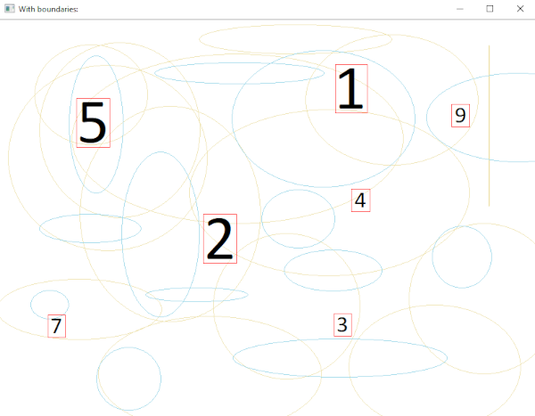

# Recognizing digits from image and solving equation
## Project goal is to extract equation from an image and solve it.
***
### I'm currently working at this project. So there is still a lot of work to do.
### TODO: 
* Better accuracy on recognizing digits
* Train network to recognize signs
* Implement negative numbers
* Create solving brain  
#### IN FUTURE:
* Variables
* Functions
* More advanced math
* Recognizing directly from camera image
***
### About neural net
Neural net is trained to recognize digits based on MNIST database. Currently accuracy of the net is around 87%, but I'll work on it later. Net is composed of three layers, from which first is convolutional.
***
### Process:
* Training DL model  and saving in json
* Extracting digits from image with noise. Example below.

* Loading necesarry settings and predicting digits on each extracted image